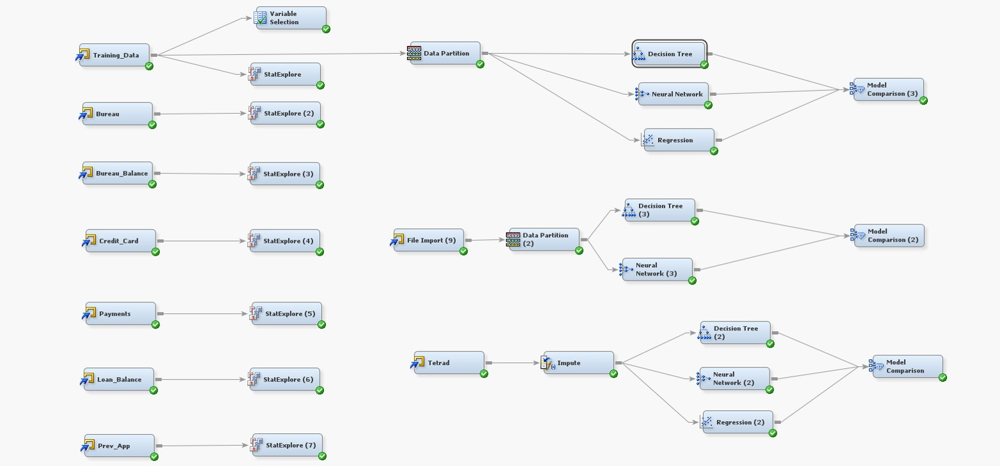
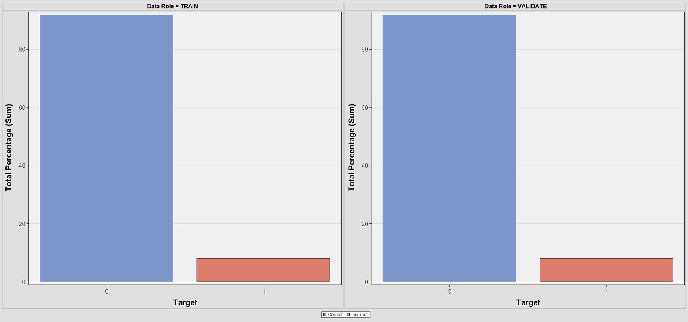

```{r setup, include=FALSE}
knitr::opts_chunk$set(echo = TRUE)
```

```{r}
library(dplyr)
library(tidyverse)
library(readr)

```


## Background and Concept of Operations


## Files


Load files from Kaggle 
```{r}

bureau <- read_csv("bureau.csv")

```

```{r}

prev_app <- read_csv("previous_application.csv")

```

```{r}

bureau_balance <- read_csv("bureau_balance.csv")

```

```{r}

POS_CASH_balance <- read_csv("POS_CASH_balance.csv")

```

```{r}

credit_card_balance <- read_csv("credit_card_balance.csv")

```


```{r}

application_train <- read_csv("application_train.csv")

```


```{r}

Tetrad_input <-  select(application_train, TARGET, EXT_SOURCE_1, EXT_SOURCE_2, EXT_SOURCE_3, OCCUPATION_TYPE, ORGANIZATION_TYPE, DAYS_BIRTH) %>% drop_na()

Tetrad_input1 <-  select(application_train, TARGET, EXT_SOURCE_1, EXT_SOURCE_2, EXT_SOURCE_3, OCCUPATION_TYPE, ORGANIZATION_TYPE, DAYS_BIRTH)

write.csv(Tetrad_input,"Tetrad_Input.csv")

write.csv(Tetrad_input1,"Tetrad_Input1.csv")

```

## SAS Enterprise Miner Analysis



Predictive Model Iteration #1



## Tetrad Analysis


## How Good Is Our Data??
```{r}

Stat_Explorer_Class <- read_csv("Stat_Explorer_Class.csv")
head(Stat_Explorer_Class, 5)

```

```{r}

Stat_Explorer_Interval <- read_csv("Stat_Explorer_Interval.csv")
head(Stat_Explorer_Interval)

```

A few of our key causal variables have large amounts of missing variables (EXT_SOURCE1, EXT_SOURCE3, and OCCUPATION_TYPE)

We use Tetrad to determine causal factors with missing variables and then formulate impute formulate to populate predicition based on case where key causal variables are missing


```{r}
# Placeholder script for listing all Missing Variable 'case_when' impute methods
#final_Model_data <- Tetrad_Input2 %>% 
#   mutate(TARGET = case_when(EXT_SOURCE == 0 & Depot_DLA$`UFO QTY` <= 1 ~ "Yellow",
#                              Depot_DLA$`UFO QTY` >= 1 ~ "Red", 
#                              Depot_DLA$`UFO QTY` >= 1 ~ "Red",
#                              Depot_DLA$`UFO QTY` >= 1 ~ "Red",
#                             TRUE ~ '0')) 
```


